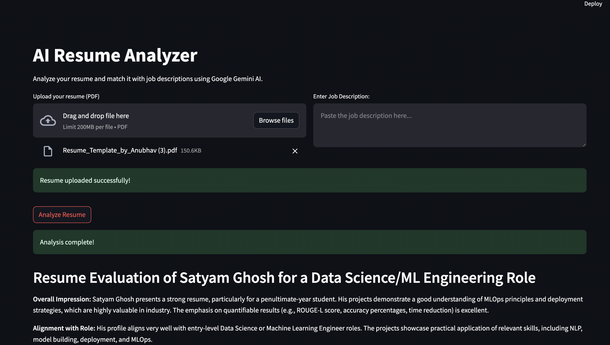

# 🧠 AI-Powered Resume Analyzer

An intelligent resume evaluator built to mimic the insight of a seasoned HR professional. This app leverages **Google Generative AI (Gemini)** to parse resumes, assess job compatibility, and deliver personalized, actionable feedback — helping job seekers refine their profiles with AI precision.

---

## 📋 Overview

The AI-Powered Resume Analyzer acts as your **virtual HR assistant**, offering:

* ✨ One-line resume summaries.
* 📈 Skill analysis and improvement suggestions.
* 🎯 Resume–Job Description (JD) compatibility scoring.
* 🧭 Personalized course recommendations to enhance profiles.
* ✅ Clear, actionable feedback for both job seekers and recruiters.

---

## 🔑 Features

### 1. General Resume Analysis

* ✅ Auto-summarizes resumes in a single impactful line.
* 🧠 Highlights strengths, weaknesses, and current skill sets.
* 🔍 Identifies skill gaps and recommends relevant improvements.
* 📚 Suggests courses to boost profile alignment with industry standards.

### 2. Resume Matching with Job Descriptions

* 🔗 Analyzes how well a resume matches a custom JD.
* 📊 Outputs a match score (%) based on keyword and skill overlap.
* ⚠️ Highlights missing skills with feedback.
* 🛠️ Indicates resume readiness with suggestions for refinement.

---

## 🛠 Tech Stack

| Component          | Technology                    |
| ------------------ | ----------------------------- |
| Frontend           | Streamlit                     |
| Backend            | Python                        |
| AI Model           | Google Generative AI (Gemini) |
| PDF Parsing        | `pdfplumber`                  |
| OCR Fallback       | `pytesseract`, `pdf2image`    |
| Environment Config | `.env` for API key management |

---

## ⚙️ How It Works

### 🔍 Resume Parsing

* Extracts text from PDFs via `pdfplumber`.
* Falls back to `pytesseract` OCR for scanned/image-based PDFs.

### 🤖 AI-Driven Analysis

* Uses Google Gemini to:

  * Summarize resume content.
  * Evaluate alignment with job requirements.
  * Provide skill and course suggestions.

### 📈 Output & Insights

* Returns compatibility percentage between resume & JD.
* Highlights gaps and recommends next steps.
* Provides clear, structured improvement tips.

---

## 🖼 Sample Output 



---

## 🙌 Contributing

We welcome community contributions to enhance the tool.

```bash
# Fork the repository
# Create a new branch
git checkout -b feature/your-feature-name

# Make your changes
# Push and submit a pull request
```

Please include a clear description of the feature or fix in your pull request.

---

## 📄 License

[MIT License](LICENSE)

---


